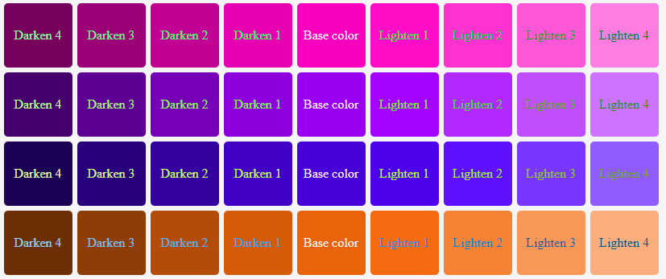
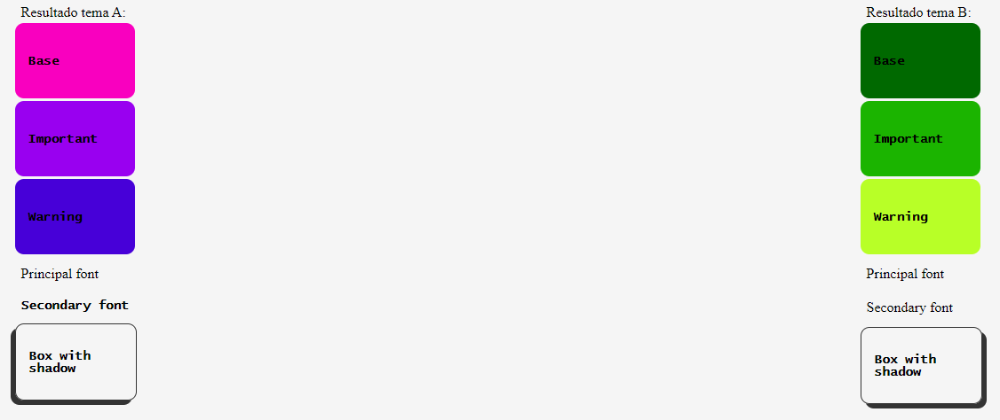
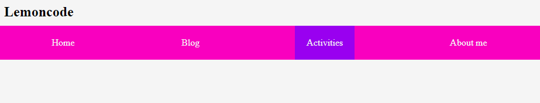
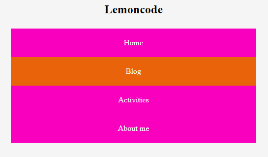
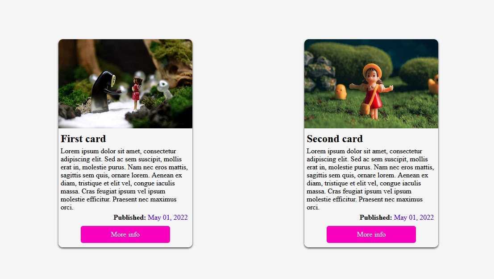
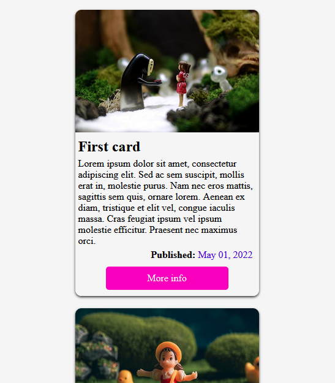

# Module 1 - Layout

[Go back - Index](../../README.md#sub-section)

[Go back - Module 1](../module1layout.md#sub-section) 
   
  

 
  

## Layout Básico ✨
 
<ol>
  <li>Crear una paleta de colores dinámica</li>
  
    
  <li>Crear dos temas distintos y mostrar los resultados en una página.</li>
  
    
  <li>Crear la barra de navegación de la imagen usando flexbox.</li>
  <ol>
    <li>width > 768px</li>
    
      
    <li>max-width: 768px</li>
    
  </ol> 
    
  <li>Crearemos un elemento de tipo card con Grid CSS.</li>
  <ol>
    <li>width > 768px</li>
    
      
    <li>max-width: 768px</li>
    
  </ol> 
</ol> 