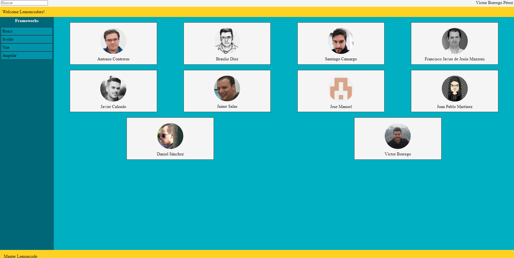
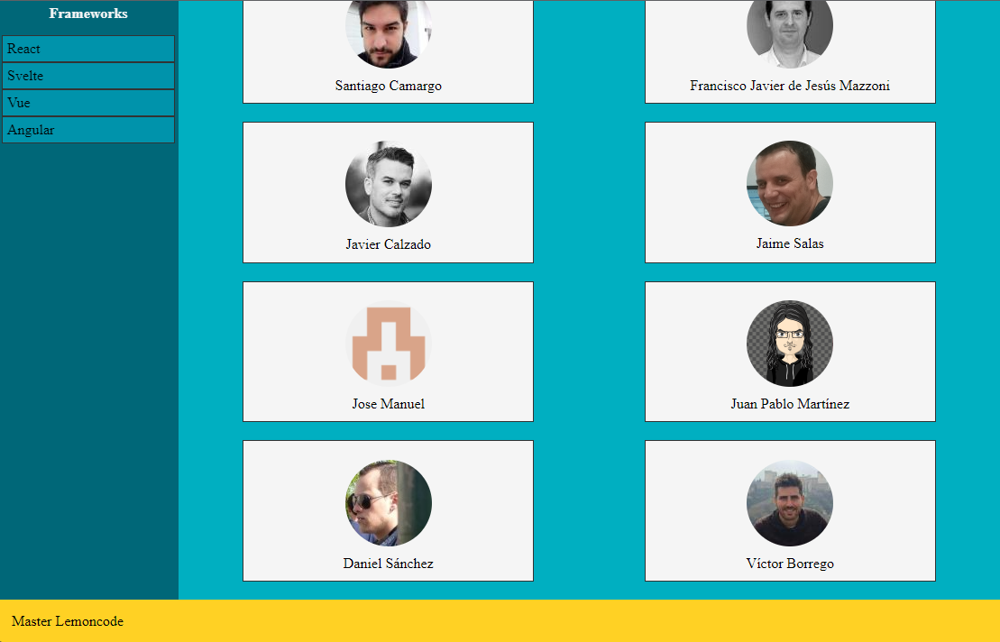
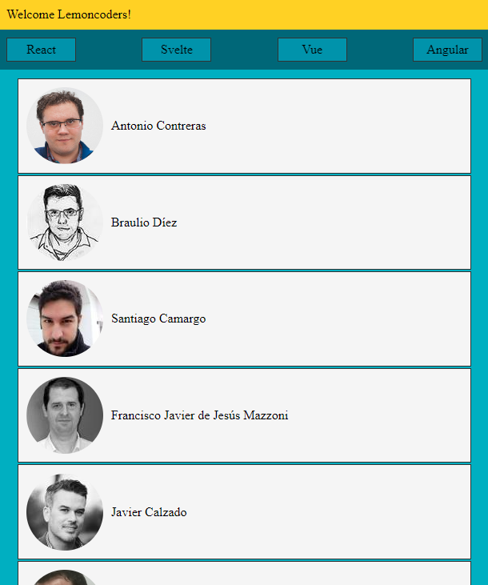

# Module 1 - Layout

[Go back - Index](../../README.md#sub-section)

[Go back - Module 1](../module1layout.md#sub-section) 

   
  

 
  

## Layout Extra ⭐ 
 
<ol>
  <li>Layout para una aplicación responsive.</li>
  
  <li>Al hacer scroll no perdemos la barra de navegación</li>
  
  <li>Diseño Mobile/Tablet (hasta 768px de ancho)</li>
  
</ol> 