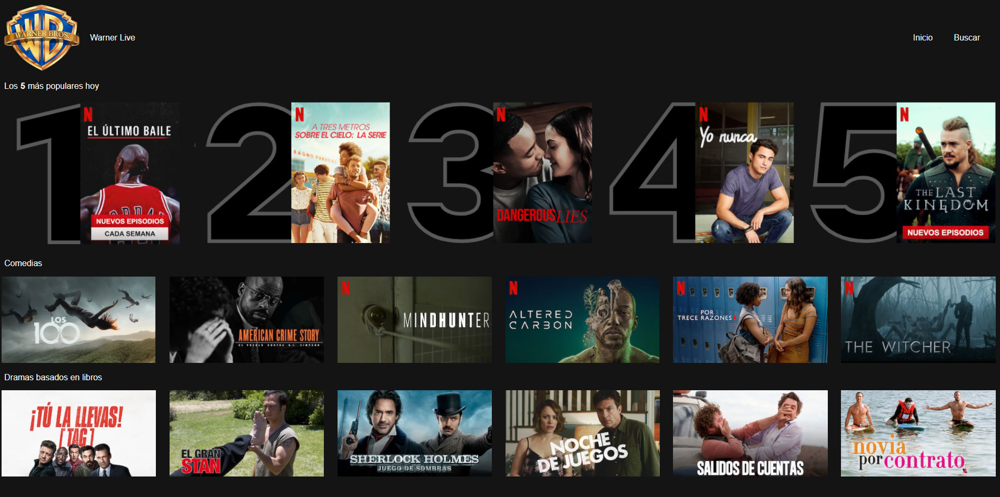
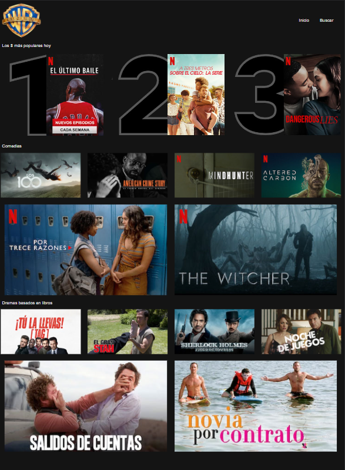
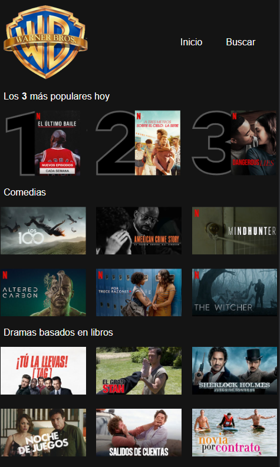
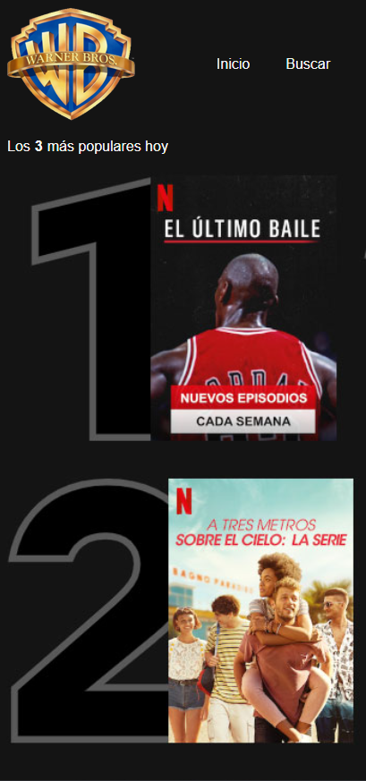

# Module 1 - Layout

[Go back - Index](../../../README.md#sub-section)

[Go back - Module 1](../../module1layout.md#sub-section) 

   
  

 
  

## Layout Reto 🌟
 
<ol>
  <li>Diseño de una página para una plataforma online de vídeo en streaming.</li>
  <ol>
    <li>Diseño Desktop (ancho 1280px mínimo)</li>
    
      
    <li>Diseño Mobile/Tablet (1024px - 1280px)</li>
    
    <li>Diseño Mobile/Tablet (420px - 1024px)</li>
    
    <li>Diseño Mobile/Tablet (420px máximo)</li>
    
  </ol> 
</ol> 
